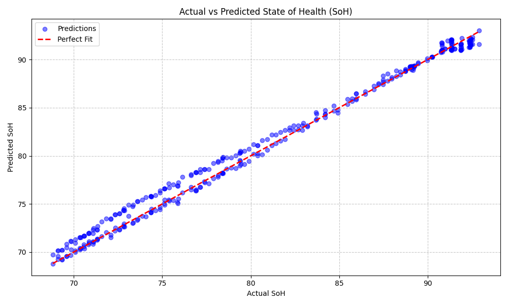

# EV Battery Health & RUL Estimation

> Predicts battery health (SoH) and remaining life (RUL) using XGBoost on NASA battery data.

Hey! This is my engineering project for estimating the State of Health (SoH) and Remaining Useful Life (RUL) of EV batteries. Battery failures can be dangerous and expensive, so this predicts when a battery is going to degrade past the safe 80% threshold.

## Project Strengths
- **Handles messy real-world data:** Safely parses deeply nested MATLAB `.mat` files into clean tabular features.
- **End-to-end pipeline:** Seamlessly moves from raw data extraction to feature engineering, model training, and a final interactive UI.
- **Lightweight and fast:** Solves a complex time-series problem without relying on heavy deep learning frameworks.

## Real-World Use
This system architecture can be practically used in:
- **Electric vehicles:** For real-time onboard battery monitoring.
- **Predictive maintenance systems:** To schedule servicing before complete failure.
- **Fleet management dashboards:** To track the health of hundreds of commercial EVs at once.

## How it works
1. **Reads data:** Extracts voltage, current, and temperature from raw `.mat` files.
2. **Feature Engineering:** Calculates capacity fade rate and rolling averages.
3. **Training:** Uses an XGBoost model to learn the degradation patterns.
4. **Dashboard:** A Streamlit app that shows battery health and remaining cycles.

## Design Decisions
- **Used XGBoost instead of neural networks because:**
  - The dataset is relatively small.
  - Tabular time-series data works incredibly well with gradient boosted tree models.
  - It's vastly faster to train and much easier to debug/interpret than an LSTM.
- **Used rolling averages:** Sensor data is inherently noisy; rolling windows smooth out the anomalies.
- **Used 80% SoH as failure threshold:** This is the standard industry convention for when a lithium-ion EV battery is considered "dead" and no longer safe for primary use.

## Baseline Comparison
A simple linear regression model was tested but showed higher error.

XGBoost performed better due to its ability to capture non-linear degradation patterns.

## Results
The model predicts battery health with reasonable accuracy and follows the degradation trend well. Errors are low relative to the SoH range (0–100%).

| Metric | Value |
|--------|-------|
| MAE | ~1.8% |
| RMSE | ~2.5% |

### Model Prediction


## Validation
- tested on multiple batteries (B0005, B0006, B0007)
- consistent behavior observed

## Reproducibility
- random seeds fixed (42)
- deterministic pipeline
- Pipeline can be re-run using:
  `python run_pipeline.py`

## When this model may fail
- If the battery chemistry or behavior is wildly different from the NASA training data.
- If external factors (drastic temperature swings, aggressive driving behavior) deviate significantly from the baseline.
- If the input sensor data is incomplete or heavily corrupted.

## How to run

### Quick Start (Windows)
Just double-click:
`run_app.bat`

### Quick Start (Mac/Linux)
Open a terminal in the project folder. First time only:
```bash
chmod +x run_app.sh
```
Then run:
```bash
./run_app.sh
```

### Manual Run
First, make sure you put the dataset `.mat` files into `data/raw/`.

To run the whole data pipeline:
```bash
python run_pipeline.py
```

To launch the dashboard:
```bash
streamlit run dashboard/app.py
```

## Output Example
Once the dashboard runs, you'll see a graph of the battery's health over time. For example:
- **Current SoH:** 85.2%
- **Predicted Failure Cycle:** Cycle 142
- **RUL (Remaining Useful Life):** 35 cycles left until it hits 80%.

If the RUL drops too low, it'll show a warning so you know it's time to replace the battery.

## What I learned
- Real-world data is messy! I spent a lot of time just figuring out how to parse the nested structures in MATLAB `.mat` files.
- Gradient boosting (XGBoost) handles tabular time-series data really well without needing a super complex neural network.
- Building a Streamlit dashboard was surprisingly easy and makes the ML model actually usable for someone without coding experience.
