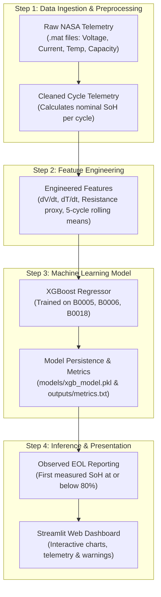

# EV Battery Health & Remaining Useful Life (RUL) Predictor

[](https://www.python.org/)
[](LICENSE)
[](https://streamlit.io)
[](https://xgboost.readthedocs.io/)
[](#)

> Machine learning pipeline predicting battery State of Health (SoH) from sensor telemetry and reporting observed end-of-life status on NASA battery profiles.

---

## 📸 Dashboard Preview


*Interactive Streamlit dashboard for historical State of Health (SoH), operating temperatures, and battery condition alerts.*

---

## ⚡ What is this?

This is an end-to-end engineering project that analyzes lithium-ion battery degradation over charge-discharge cycles. Using NASA laboratory telemetry, the system predicts **State of Health (SoH)** from voltage, current, and temperature sensors and identifies when an observed battery profile has crossed the 80% end-of-life threshold. It does not extrapolate a future RUL for a battery that has not yet crossed that threshold.

### 🚗 Why it matters:
* **Maintenance Planning:** Transparent health estimates can support battery inspection and maintenance workflows.
* **Second-Life Research:** Historical health trends can support research into second-life battery assessment.
* **Important:** This research project is not a safety monitor, certified battery-management system, or replacement for engineering inspection.

---

## 📊 Key Results at a Glance

| Benchmark Metric | XGBoost (Ours) | Baseline Linear Regression | Evaluation Notes |
| :--- | :--- | :--- | :--- |
| **Primary Test MAE (Unseen Cell B0007)** | **1.7999% SoH** | 7.6508% SoH | Held-out battery; sensor-only features |
| **Primary Test RMSE (Unseen Cell B0007)**| **2.1841% SoH** | 10.0095% SoH | Held-out battery; sensor-only features |
| **Leave-One-Battery-Out Mean MAE** | **2.6160% SoH** | 9.8507% SoH | **73.4% lower error** across four cells |
| **Tested Batteries** | B0005, B0006, B0007, B0018 | NASA Ames PCoE 18650 run-to-failure cycles |

*(Units note: All MAE and RMSE values are expressed in percentage points of State of Health: `% SoH`).*

---

## 📚 Table of Contents
* [Key Definitions](#-key-definitions-in-one-line)
* [Features](#-features)
* [How It Works](#-how-it-works)
* [Project Structure](#-project-structure)
* [Dataset](#-dataset)
* [Quick Start](#-quick-start)
* [Dashboard Views](#-dashboard-views)
* [Evaluation & Results](#-evaluation--results)
* [Engineering Design Decisions](#-engineering-design-decisions)
* [Limitations & Future Roadmap](#-limitations--future-roadmap)
* [What I Learned](#-what-i-learned)
* [Tech Stack](#-tech-stack)
* [Acknowledgements & Citation](#-acknowledgements--citation)
* [License & Author](#-license--author)

---

## 💡 Key Definitions (in plain English)

* **State of Health (SoH):** Measured capacity relative to the cell's first valid measured capacity, expressed as a percentage.
* **Remaining Useful Life (RUL):** Cycles remaining before a selected end-of-life threshold. This release reports zero after an observed crossing and does not forecast a future crossing.
* **Capacity Fade:** The gradual, irreversible drop in a battery's maximum energy storage capability over repeated use.
* **Rolling Average:** A moving average calculated across the past 5 cycles to filter out temporary electrical noise and sensor fluctuations.
* **XGBoost:** An optimized machine learning algorithm that builds a sequence of smart decision trees, with each tree correcting the errors of the previous ones.

---

## ✨ Features

- [x] **Safe MATLAB Parsing:** Automated extraction of nested telemetry (`.mat`) structures into clean tabular records.
- [x] **Engineered Telemetry:** Computes cycle-over-cycle voltage rate ($\frac{dV}{dt}$), thermal shifts ($\frac{dT}{dt}$), and internal cell resistance proxy ($V/I$).
- [x] **Leakage-Free Validation:** Strict battery-wise evaluation (training on B0005/B0006/B0018, testing on completely unseen B0007).
- [x] **Interactive Streamlit Web App:** Historical health metrics, SoH predictions, observed end-of-life status, and condition alerts.
- [x] **Automated Pipeline Runner:** Step-by-step terminal execution with clean progress tracking and smoke tests.

---

## 🛠️ How It Works


```mermaid
flowchart TD
    subgraph S1["Step 1: Data Ingestion & Preprocessing"]
        A["Raw NASA Telemetry<br/>(.mat files: Voltage, Current, Temp, Capacity)"] --> B["Cleaned Cycle Telemetry<br/>(Calculates nominal SoH per cycle)"]
    end

    subgraph S2["Step 2: Feature Engineering"]
        B --> C["Engineered Features<br/>(dV/dt, dT/dt, Resistance proxy, 5-cycle rolling means)"]
    end

    subgraph S3["Step 3: Machine Learning Model"]
        C --> D["XGBoost Regressor<br/>(Trained on B0005, B0006, B0018)"]
        D --> E["Model Persistence & Metrics<br/>(models/xgb_model.pkl & outputs/metrics.txt)"]
    end

    subgraph S4["Step 4: Inference & Presentation"]
        E --> F["Observed EOL Reporting<br/>(First measured SoH at or below 80%)"]
        F --> G["Streamlit Web Dashboard<br/>(Interactive charts, telemetry & warnings)"]
    end
```

1. **Step 1: Read Telemetry:** Parses nested MATLAB `.mat` files into structured cycle metrics (voltage, current, temperature, discharge capacity).
2. **Step 2: Feature Engineering:** Calculates rate of change ($\frac{dV}{dt}$, $\frac{dT}{dt}$), internal resistance proxy, and 5-cycle moving averages.
3. **Step 3: Train XGBoost:** Learns non-linear electrochemical degradation patterns on training batteries and evaluates on a held-out battery.
4. **Step 4: End-of-Life Reporting:** Reports the first observed 80% threshold crossing; future RUL is not extrapolated by this release.

---

## 📂 Project Structure

```text
EV-BATTERY-HEALTH/
│
├── dashboard/
│   └── app.py                      # Interactive Streamlit monitoring dashboard
│
├── data/
│   ├── raw/                        # NASA .mat files (downloaded by user or extracted)
│   └── processed/
│       ├── cleaned_data.csv        # Generated from raw data when available
│       └── features.csv            # Final engineered feature table
│
├── docs/
│   ├── ARCHITECTURE.md             # In-depth system module architecture & data flow
│   ├── DATASET.md                  # NASA experimental cycling protocol & citation
│   ├── METHODOLOGY.md              # Feature engineering & ML design rationale
│   ├── RESULTS.md                  # Comprehensive benchmarks, LOBO tables & discussion
│   ├── DASHBOARD.md                # Dashboard usage walkthrough & screenshot gallery
├── PROJECT_GUIDE.md            # Setup, pipeline stages, and model scope
│   ├── LIMITATIONS_AND_FUTURE_WORK.md # Operational boundaries & technical roadmap
│   └── images/                     # Real figures and authentic UI screenshots
│
├── models/
│   ├── feature_schema.json         # Exact list of ordered features used by model
│   └── xgb_model.pkl               # Serialized trained XGBoost model artifact
│
├── outputs/
│   ├── metrics.txt                 # Model benchmark evaluation metrics
│   └── soh_prediction_scatter.png  # Prediction scatter plot
│
├── scripts/
│   ├── capture_screenshots.py      # Automated browser script to capture dashboard UI
│   └── generate_figures.py         # Generates all publication-quality evaluation charts
│
├── src/
│   ├── features.py                 # Feature engineering functions & calculations
│   ├── preprocess.py               # Robust MATLAB .mat parsing logic
│   ├── rul_estimator.py            # 80% SoH threshold crossing & RUL estimation
│   └── soh_model.py                # Model training, baseline evaluation & validation
│
├── tests/
│   └── test_pipeline.py            # Smoke and regression tests
│
├── .gitignore                      # Clean exclusion of temporary & cache files
├── LICENSE                         # Permissive MIT License (Baliji Niroop)
├── README.md                       # Main project documentation & quickstart
├── requirements.txt                # Runtime and test dependencies
├── requirements-dev.txt            # Optional Playwright screenshot tooling
├── run_app.bat                     # One-click Windows launch script
├── run_app.sh                      # One-click macOS / Linux launch script
└── run_pipeline.py                 # Master step-by-step ML pipeline runner
```

---

## 📦 Dataset

The project uses the **NASA Prognostics Center of Excellence (PCoE) Li-ion Battery Aging Dataset** (18650 cells cycled to failure under repeated charging, discharging, and impedance sweeps).

* **Cells analyzed:** B0005, B0006, B0007 (room temperature 24°C) and B0018 (accelerated aging).
* **Already included:** To save you time, `data/processed/features.csv` is already included in this repository so you can immediately train models and run the dashboard!
* **Raw files:** If you wish to re-parse the original ~150 MB raw `.mat` files from scratch, see [docs/DATASET.md](docs/DATASET.md) for direct download links and directory setup instructions.

---

## 🚀 Quick Start

### 1. Clone the repository
```bash
git clone https://github.com/Baliji-Niroop/EV-Battery-Health-Predictor.git
cd EV-Battery-Health-Predictor
```

### 2. Set up virtual environment & install requirements
```bash
# Windows
python -m venv venv
venv\Scripts\activate
pip install -r requirements.txt

# macOS / Linux
python3 -m venv venv
source venv/bin/activate
pip install -r requirements.txt
```

### 3. Run the automated ML pipeline
Runs preprocessing, feature engineering, model training, and RUL estimation in 4 clean steps:
```bash
python run_pipeline.py
```

### 4. Run the test suite
```bash
python -m pytest -q
```

### 5. Launch the Streamlit dashboard
```bash
# Windows
run_app.bat
# or directly:
python -m streamlit run dashboard/app.py

# macOS / Linux
./run_app.sh
# or directly:
python3 -m streamlit run dashboard/app.py
```
Open your browser at **`http://localhost:8501`**.

---

## 🖥️ Dashboard Views

| View 1: Real-Time Health Status | View 2: State of Health Degradation Trend |
| :---: | :---: |
|  |  |
| *Status metrics, cycle count, and condition badge* | *Complete historical capacity fade curve* |

| View 3: SoH Predictions & EOL Status | View 4: Low-Health Alert |
| :---: | :---: |
|  |  |
| *Predicted vs. measured SoH and observed EOL status* | *Alert when measured SoH drops below the selected threshold* |

---

## 📈 Evaluation & Results

### 1. State of Health Degradation Profiles

*Figure 1: Real measured degradation curves across cells B0005, B0006, and B0007. Every cell eventually degrades below the 80% EOL threshold.*

### 2. Predicted vs. Actual SoH (Held-Out Battery B0007)

*Figure 2: Performance on unseen battery B0007 (XGBoost MAE: 1.80% SoH), with predicted and measured degradation trajectories.*

### 3. Baseline Comparison (Sensor-Only Features)

*Figure 3: Leave-one-battery-out sensor-only comparison: XGBoost reduces mean absolute error by 73.4% across four cells.*

### 4. Feature Importance Rankings

*Figure 4: Relative feature importance shows that discharge capacity, capacity fade rate, and temperature are key indicators of health.*

---

## 💡 Real Dashboard Output Example

The supplied B0007 profile is a completed historical run: its observed SoH first reaches 80% at cycle 443 and is 75.75% at its last observed cycle (614). The dashboard reports that end-of-life has been reached and shows 0 remaining cycles. For a profile still above 80%, future RUL is reported as unavailable; the current model does not forecast beyond the observed data.

---

## ⚙️ Engineering Design Decisions

1. **Why XGBoost instead of Deep Neural Networks (LSTM)?**
   * **Dataset Size:** With 1,277 observed records across four cells, LSTMs easily overfit and require complex tuning. Gradient-boosted trees perform well on tabular sensor aggregates.
   * **Inference Latency:** Tree evaluation executes in microseconds on low-cost automotive microcontrollers.
   * **Explainability:** Feature importance provides direct insight into why a health prediction was made.
2. **Why Rolling Averages?**
   * Battery voltage and temperature fluctuate due to ambient chamber cycles and load variations. 5-cycle rolling windows filter out transient noise without lagging physical trends.
3. **Why the 80% SoH Threshold?**
   * It is a commonly used battery end-of-life convention; it is not a universal safety guarantee and may vary by application.

---

## ⚠️ Limitations & Future Work

* **Laboratory Constant Discharge:** Tested under constant 2.0A load rather than real-world dynamic driving cycles (like WLTP or US06).
* **Controlled Temperature:** Cycled primarily at 24°C; real cars face winter sub-zero freezes and summer desert heat.
* **RUL boundary:** The current release reports observed end-of-life; it does not extrapolate future SoH from a still-healthy profile.
* **Roadmap:** Incorporate variable driving cycles from the Oxford battery dataset, implement thermal compensation curves, forecast future SoH with time-series validation, and export models to embedded C for microcontrollers.
* *Read more in [docs/LIMITATIONS_AND_FUTURE_WORK.md](docs/LIMITATIONS_AND_FUTURE_WORK.md).*

---

## 🎓 What I Learned

* **Real Data is Messy:** Extracting nested MATLAB structs required building defensive parsing utilities that handle missing fields, unexpected array shapes, and varying cycle lengths.
* **Data Leakage Matters:** Randomly splitting time-series cycles creates deceptively perfect metrics ($0.26\%$ error). A proper battery-wise split reveals true model generalization.
* **End-to-End Delivery:** ML is only useful when engineers and technicians can interact with it. Pairing an XGBoost pipeline with a Streamlit UI makes predictive maintenance practical.

---

## 💻 Tech Stack

* **Language:** Python 3.9+
* **Data Analysis & Processing:** NumPy, Pandas, SciPy (loadmat)
* **Machine Learning:** XGBoost, Scikit-learn, Joblib
* **Visualization:** Matplotlib, Streamlit
* **Automation & Testing:** Pytest, Playwright, Subprocess

---

## 📖 Acknowledgements & Citation

Dataset provided by the **NASA Ames Prognostics Center of Excellence (PCoE)**:
> B. Saha and K. Goebel (2007). "Battery Data Set", NASA Ames Prognostics Data Repository, NASA Ames Research Center, Moffett Field, CA.

---

## 📄 License & Author

Distributed under the **MIT License**. See [`LICENSE`](LICENSE) for details.

* **Author:** Baliji Niroop
* **Major:** B.Tech in Automobile Engineering
* **GitHub:** [@Baliji-Niroop](https://github.com/Baliji-Niroop)
* **Project Repo:** [EV-Battery-Health-Predictor](https://github.com/Baliji-Niroop/EV-Battery-Health-Predictor)
